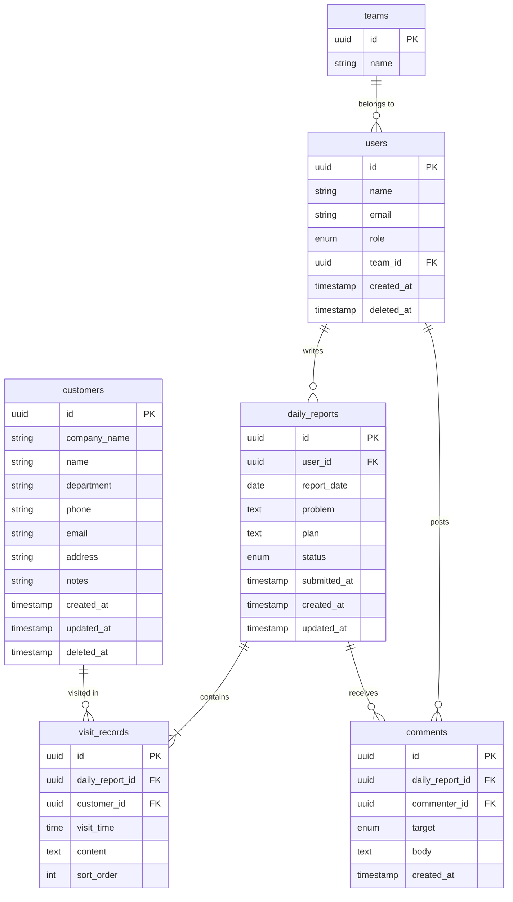

# 営業日報システム — ER図

**バージョン**: 1.3  
**作成日**: 2026-05-13

---

## 変更履歴

| バージョン | 変更内容 |
|-----------|---------|
| 1.0 | 初版作成 |
| 1.1 | `customers` に `company_name` / `email` / `address` / `updated_at` 追加、`visit_records` に `visit_time` 追加 |
| 1.2 | `customers` に `deleted_at` 追加（論理削除対応） |
| 1.3 | `users` の `deleted_at` を明示（論理削除対応） |

---

## ER図

---

## テーブル定義

### users（営業マスタ）

| カラム | 型 | 制約 | 説明 |
|-------|----|------|------|
| `id` | uuid | PK | ユーザーID |
| `name` | string | NOT NULL | 氏名 |
| `email` | string | NOT NULL, UNIQUE | メールアドレス |
| `role` | enum | NOT NULL | `sales` / `manager` / `admin` |
| `team_id` | uuid | FK → teams.id | 所属チームID（任意） |
| `created_at` | timestamp | NOT NULL | 作成日時 |
| `deleted_at` | timestamp | NULL | 論理削除日時（NULL = 有効） |

---

### teams（チームマスタ）

| カラム | 型 | 制約 | 説明 |
|-------|----|------|------|
| `id` | uuid | PK | チームID |
| `name` | string | NOT NULL, UNIQUE | チーム名 |

---

### customers（顧客マスタ）

| カラム | 型 | 制約 | 説明 |
|-------|----|------|------|
| `id` | uuid | PK | 顧客ID |
| `company_name` | string | NOT NULL | 会社名 |
| `name` | string | NOT NULL | 担当者名 |
| `department` | string | NULL | 部署名 |
| `phone` | string | NULL | 電話番号 |
| `email` | string | NULL | メールアドレス |
| `address` | string | NULL | 住所 |
| `notes` | string | NULL | 備考 |
| `created_at` | timestamp | NOT NULL | 作成日時 |
| `updated_at` | timestamp | NOT NULL | 更新日時 |
| `deleted_at` | timestamp | NULL | 論理削除日時（NULL = 有効） |

---

### daily_reports（日報）

| カラム | 型 | 制約 | 説明 |
|-------|----|------|------|
| `id` | uuid | PK | 日報ID |
| `user_id` | uuid | FK → users.id, NOT NULL | 担当者ID |
| `report_date` | date | NOT NULL | 日報の日付 |
| `problem` | text | NULL | 課題・相談 |
| `plan` | text | NULL | 明日やること |
| `status` | enum | NOT NULL | `draft` / `submitted` |
| `submitted_at` | timestamp | NULL | 提出日時 |
| `created_at` | timestamp | NOT NULL | 作成日時 |
| `updated_at` | timestamp | NOT NULL | 更新日時 |

**ユニーク制約**: `(user_id, report_date)`

---

### visit_records（訪問記録）

| カラム | 型 | 制約 | 説明 |
|-------|----|------|------|
| `id` | uuid | PK | 訪問記録ID |
| `daily_report_id` | uuid | FK → daily_reports.id, NOT NULL | 日報ID |
| `customer_id` | uuid | FK → customers.id, NOT NULL | 顧客ID |
| `visit_time` | time | NULL | 訪問時刻 |
| `content` | text | NOT NULL | 訪問内容 |
| `sort_order` | int | NOT NULL | 表示順（1始まり） |

---

### comments（コメント）

| カラム | 型 | 制約 | 説明 |
|-------|----|------|------|
| `id` | uuid | PK | コメントID |
| `daily_report_id` | uuid | FK → daily_reports.id, NOT NULL | 日報ID |
| `commenter_id` | uuid | FK → users.id, NOT NULL | 投稿者ユーザーID |
| `target` | enum | NOT NULL | `problem` / `plan` |
| `body` | text | NOT NULL | コメント本文 |
| `created_at` | timestamp | NOT NULL | 投稿日時 |
